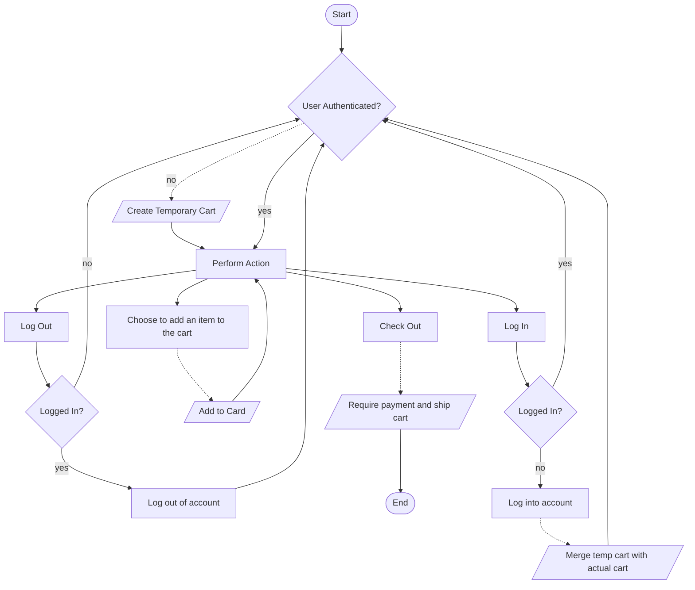

# General Workflow
## Description
The following is a rough markup of what a potential workflow for our app could look like. This workflow is grossly oversimplified, but it defines a tight loop in which the user cannot "break" the flow.

## Noteworthy Points
This flowchart takes the liberty of assuming a few things, like allowing the user to shop without signing in and merging the temporary cart with the user's actual cart if the user decides to sign in later. It is also implied that our app will persist user carts such that the contents of the cart will remain across shopping sessions.

These are points that we as a team must discuss at some point before we start development.
